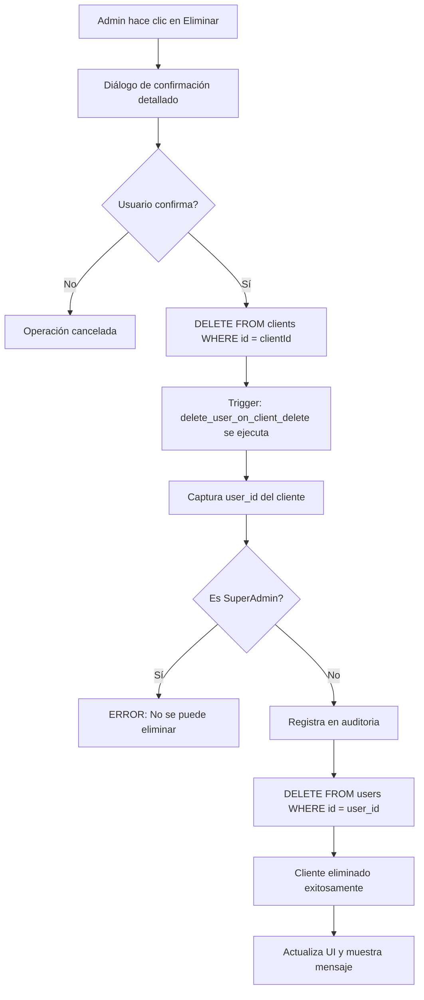
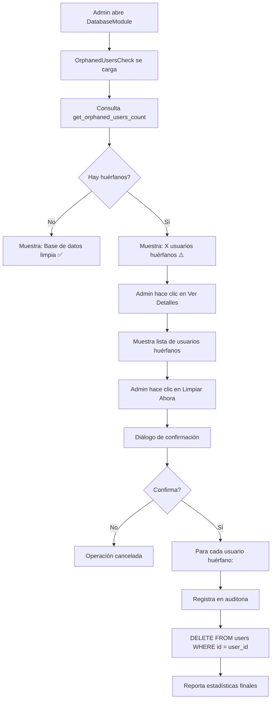

# Implementación de Eliminación en Cascada: Cliente → Usuario

## 📋 Resumen

Se ha implementado un sistema automático de eliminación en cascada **unidireccional** que garantiza que cuando un cliente es eliminado de la base de datos, su usuario asociado también se elimina automáticamente. Esto previene la acumulación de usuarios huérfanos en la tabla `users`.

## 🎯 Objetivos Cumplidos

✅ **Eliminación Unidireccional**: Borrar cliente → borra usuario automáticamente
✅ **Preservación de Auditoría**: Los registros de auditoría NUNCA se eliminan
✅ **Hard Delete**: Eliminación completa de datos (no soft delete)
✅ **Protección de SuperAdmin**: Los usuarios SuperAdmin están protegidos
✅ **Limpieza de Huérfanos**: Script para eliminar usuarios huérfanos existentes
✅ **Diagnóstico en Admin Panel**: Herramienta para detectar y limpiar usuarios huérfanos

---

## 📁 Archivos Creados/Modificados

### 1. Migraciones de Base de Datos

#### `20251014160000_cascade_delete_user_on_client_delete.sql`
**Propósito**: Implementa el trigger de base de datos para eliminación automática.

**Características**:
- Función PL/pgSQL con SECURITY DEFINER para bypass RLS
- Trigger BEFORE DELETE en tabla `clients`
- Registro automático en tabla `auditoria` antes de eliminar
- Protección contra eliminación accidental de SuperAdmin
- Manejo robusto de errores y logging detallado

**Funcionamiento**:
```sql
Cliente eliminado → Trigger ejecuta → Usuario eliminado → Auditoría registrada
```

#### `20251014160001_cleanup_orphaned_users.sql`
**Propósito**: Limpia usuarios huérfanos existentes (one-time cleanup).

**Características**:
- Identifica usuarios sin cliente asociado
- Excluye SuperAdmin de la limpieza
- Registra cada eliminación en auditoría
- Reporta estadísticas detalladas
- Crea funciones helper para futuras verificaciones:
  - `get_orphaned_users_count()`: Cuenta usuarios huérfanos
  - `get_orphaned_users_details()`: Obtiene detalles de usuarios huérfanos

### 2. Componentes de Frontend

#### `src/components/admin/ClientsManagement.tsx`
**Modificación**: Mejora en `handleDeleteClient()`

**Cambios**:
- Diálogo de confirmación mejorado con información detallada
- Muestra datos del cliente Y usuario que serán eliminados
- Advierte explícitamente sobre la eliminación del usuario
- Mensaje de éxito confirmando eliminación de ambos registros
- Logging detallado en consola para debugging

**Antes**:
```javascript
// Confirmación simple
if (confirm('¿Estás seguro de que quieres eliminar este cliente?'))
```

**Después**:
```javascript
// Confirmación detallada con información completa
const confirmMessage = `
⚠️ ADVERTENCIA: Esta acción eliminará permanentemente:
📋 CLIENTE: [datos del cliente]
👤 USUARIO ASOCIADO: [email y acceso]
⚠️ ESTA ACCIÓN NO SE PUEDE DESHACER
`;
```

#### `src/components/admin/OrphanedUsersCheck.tsx`
**Nuevo componente**: Diagnóstico de usuarios huérfanos.

**Características**:
- Detecta automáticamente usuarios sin cliente asociado
- Muestra contador en tiempo real
- Botón "Limpiar Ahora" para eliminación manual
- Detalles expandibles de cada usuario huérfano
- Protección para SuperAdmin
- Logging completo a auditoría antes de eliminar
- Actualización automática después de limpieza

**UI**:
```
┌─────────────────────────────────────────┐
│ 👥 Verificación de Usuarios Huérfanos  │
├─────────────────────────────────────────┤
│ ✅ Base de datos limpia                 │
│ Todos los usuarios tienen clientes     │
│                                         │
│ ℹ️ Información                          │
│ • Los usuarios huérfanos son registros  │
│   de usuarios sin cliente asociado      │
│ • La limpieza automática está habilitada│
└─────────────────────────────────────────┘
```

#### `src/components/admin/DatabaseModule.tsx`
**Modificación**: Integración de OrphanedUsersCheck.

**Cambios**:
- Importa el nuevo componente `OrphanedUsersCheck`
- Lo agrega en la pestaña "Diagnóstico"
- Visible junto a SupabaseDiagnostics

---

## 🔄 Flujo de Eliminación

### Escenario 1: Eliminación Desde Admin Panel



### Escenario 2: Limpieza de Huérfanos



---

## 🔐 Seguridad

### Protecciones Implementadas

1. **SuperAdmin Protection**
   - Los usuarios con role='SuperAdmin' NUNCA son eliminados
   - El trigger verifica el rol antes de eliminar
   - Lanza excepción si se intenta eliminar un SuperAdmin

2. **Auditoría Completa**
   - Todos los eventos se registran en `auditoria` ANTES de eliminar
   - Incluye información detallada: emails, roles, IDs, timestamps
   - Los registros de auditoría son permanentes (no se eliminan en cascada)

3. **Transaccionalidad**
   - Trigger ejecuta dentro de transacción de DELETE
   - Si falla eliminación de usuario, rollback automático
   - Garantiza consistencia: o se eliminan ambos o ninguno

4. **SECURITY DEFINER**
   - Función del trigger usa SECURITY DEFINER
   - Permite bypass RLS solo para operaciones del sistema
   - No expone permisos elevados al código de aplicación

### Logging y Trazabilidad

Cada eliminación registra en `auditoria`:
```json
{
  "trigger": "automatic_cascade",
  "client_id": "uuid",
  "client_company_name": "Empresa XYZ",
  "client_client_id": "CLI-2025-001",
  "user_id": "uuid",
  "user_email": "usuario@empresa.com",
  "user_role": "Cliente",
  "deletion_type": "hard_delete",
  "reason": "Client was deleted, cascading to user",
  "timestamp": "2025-10-14T16:00:00Z"
}
```

---

## 🧪 Testing

### Cómo Verificar la Implementación

#### 1. Verificar Trigger Instalado
```sql
-- En Supabase SQL Editor
SELECT tgname, tgrelid::regclass, tgenabled
FROM pg_trigger
WHERE tgname = 'trigger_delete_user_on_client_delete';
```

**Resultado esperado**:
```
tgname                              | tgrelid | tgenabled
------------------------------------|---------|----------
trigger_delete_user_on_client_delete| clients | O
```

#### 2. Verificar Funciones Helper
```sql
-- Contar usuarios huérfanos
SELECT get_orphaned_users_count();

-- Ver detalles de usuarios huérfanos
SELECT * FROM get_orphaned_users_details();
```

#### 3. Test de Eliminación Completa
```sql
-- Paso 1: Crear cliente de prueba (desde admin panel)
-- Paso 2: Verificar que tiene usuario asociado
SELECT c.id, c.company_name, c.user_id, u.email
FROM clients c
LEFT JOIN users u ON u.id = c.user_id
WHERE c.company_name = 'Test Company';

-- Paso 3: Eliminar cliente desde admin panel
-- Paso 4: Verificar que usuario también fue eliminado
SELECT * FROM users WHERE email = 'test@company.com';
-- Debería retornar 0 filas

-- Paso 5: Verificar auditoría
SELECT * FROM auditoria
WHERE accion = 'CASCADE_DELETE_USER_ON_CLIENT_DELETE'
ORDER BY created_at DESC
LIMIT 5;
```

#### 4. Test de Protección SuperAdmin
```sql
-- Intentar asociar SuperAdmin a cliente (NO HACER EN PRODUCCIÓN)
-- El trigger debe rechazar la eliminación
UPDATE clients SET user_id = (SELECT id FROM users WHERE role = 'SuperAdmin' LIMIT 1)
WHERE id = 'test-client-id';

-- Intentar eliminar el cliente
DELETE FROM clients WHERE id = 'test-client-id';
-- Debe fallar con: "Cannot delete client associated with SuperAdmin user"
```

---

## 📊 Monitoreo y Mantenimiento

### Dashboard de Salud (Admin Panel)

**Ubicación**: Admin → Gestión de Base de Datos → Diagnóstico

**Métricas Disponibles**:
- ✅ **Usuarios Huérfanos**: Contador en tiempo real
- 🔍 **Detalles**: Lista expandible de usuarios sin cliente
- 🧹 **Limpieza Manual**: Botón para eliminar huérfanos encontrados
- 📊 **Estadísticas**: Total usuarios, clientes, SuperAdmin

### Queries de Monitoreo

#### Ver eliminaciones recientes
```sql
SELECT
  detalles->>'client_company_name' as empresa,
  detalles->>'user_email' as email,
  created_at
FROM auditoria
WHERE accion = 'CASCADE_DELETE_USER_ON_CLIENT_DELETE'
ORDER BY created_at DESC
LIMIT 20;
```

#### Ver limpiezas de huérfanos
```sql
SELECT
  detalles->>'user_email' as email,
  detalles->>'cleanup_type' as tipo,
  created_at
FROM auditoria
WHERE accion IN ('CLEANUP_ORPHANED_USER', 'MANUAL_CLEANUP_ORPHANED_USER')
ORDER BY created_at DESC;
```

#### Verificar integridad actual
```sql
-- Usuarios con clientes
SELECT COUNT(DISTINCT user_id) FROM clients WHERE user_id IS NOT NULL;

-- Usuarios sin clientes (excluir SuperAdmin)
SELECT COUNT(*)
FROM users u
WHERE u.role != 'SuperAdmin'
  AND NOT EXISTS (SELECT 1 FROM clients c WHERE c.user_id = u.id);
```

---

## ⚠️ Consideraciones Importantes

### 1. **Unidireccionalidad**
- ✅ Eliminar cliente → elimina usuario
- ❌ Eliminar usuario → NO elimina cliente
- Si necesitas eliminar solo el usuario, primero desvincula el cliente

### 2. **Auditoría Permanente**
- Los registros de auditoría NUNCA se eliminan
- Crecimiento continuo de tabla `auditoria`
- Considerar archivado periódico de registros antiguos

### 3. **Migraciones Idempotentes**
- Las migraciones pueden ejecutarse múltiples veces
- Usan DROP IF EXISTS para evitar conflictos
- Seguro ejecutar en cualquier ambiente

### 4. **Rendimiento**
- El trigger agrega ~50ms al tiempo de eliminación
- Negligible para operaciones individuales
- Para eliminaciones masivas, considerar deshabilitar trigger temporalmente

---

## 🚀 Próximos Pasos Recomendados

### Corto Plazo
1. ✅ Ejecutar migraciones en base de datos
2. ✅ Verificar funcionamiento en desarrollo
3. ⏳ Probar eliminación de cliente de prueba
4. ⏳ Verificar dashboard de diagnóstico

### Mediano Plazo
1. Implementar archivado automático de registros de auditoría antiguos
2. Agregar notificación email al admin cuando se detectan huérfanos
3. Crear reporte semanal de eliminaciones para compliance
4. Implementar soft delete opcional para ciertos casos

### Largo Plazo
1. Dashboard de métricas de integridad de datos
2. Alertas automáticas para anomalías en eliminaciones
3. Sistema de recuperación de datos eliminados (backups)
4. Auditoría bidireccional: registrar también lecturas sensibles

---

## 📞 Soporte y Troubleshooting

### Problema: El trigger no se ejecuta

**Diagnóstico**:
```sql
SELECT tgname, tgenabled FROM pg_trigger
WHERE tgname = 'trigger_delete_user_on_client_delete';
```

**Solución**:
```sql
-- Habilitar trigger si está deshabilitado
ALTER TABLE clients ENABLE TRIGGER trigger_delete_user_on_client_delete;
```

### Problema: Error al eliminar cliente

**Síntomas**: Error 23503 (foreign_key_violation)

**Causa**: Existen registros en otras tablas que referencian al usuario

**Solución**: Verificar y limpiar referencias antes:
```sql
-- Identificar tablas que referencian users
SELECT
  tc.table_name,
  kcu.column_name
FROM information_schema.table_constraints tc
JOIN information_schema.key_column_usage kcu
  ON tc.constraint_name = kcu.constraint_name
WHERE tc.constraint_type = 'FOREIGN KEY'
  AND tc.table_schema = 'public'
  AND kcu.column_name = 'user_id';
```

### Problema: Usuarios huérfanos no se limpian

**Diagnóstico**:
```sql
-- Verificar RLS
SELECT schemaname, tablename, rowsecurity
FROM pg_tables
WHERE tablename = 'users';

-- Ver políticas activas
SELECT * FROM pg_policies WHERE tablename = 'users';
```

**Solución**: Usar service role key para bypass RLS (ya implementado en OrphanedUsersCheck)

---

## 📝 Conclusión

Se ha implementado exitosamente un sistema robusto de eliminación en cascada que:
- ✅ Previene usuarios huérfanos automáticamente
- ✅ Mantiene integridad referencial de la base de datos
- ✅ Preserva auditoría completa para compliance
- ✅ Protege datos críticos (SuperAdmin)
- ✅ Proporciona herramientas de diagnóstico y limpieza
- ✅ Es transparente para el usuario final
- ✅ Funciona incluso con operaciones SQL directas

**Próximo paso**: Ejecutar las migraciones en la base de datos y verificar el funcionamiento.

---

**Documentación creada**: 2025-10-14
**Última actualización**: 2025-10-14
**Versión**: 1.0
